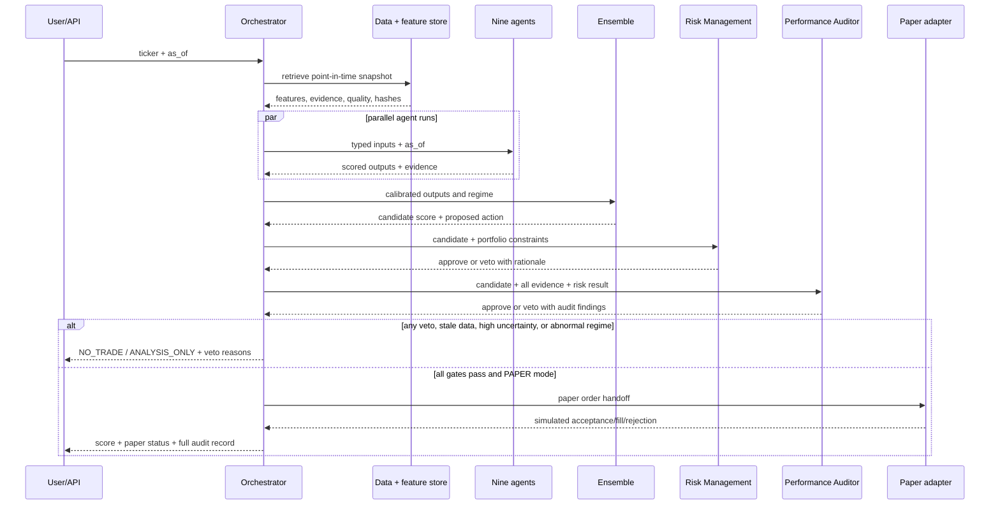

# Multi-Agent Design

Agents are analysts, not autonomous authorities. They communicate through
versioned JSON schemas and cite evidence. A failed agent returns `UNAVAILABLE`
with a reason; it does not invent a score.

## Roster Reconciliation

The canonical decision roster has nine agents: Market Data, Technical Analysis,
Fundamental Analysis, News Intelligence, Sentiment, Macroeconomic, Market
Regime, Risk Management, and Performance Auditor. Execution is not a decision
agent. It is a separate paper-order adapter owned by the control plane, because
it must not vote on a score and must never bypass governance. This preserves the
requested ten responsibilities while keeping the decision boundary explicit.

## Responsibilities and Outputs

| Agent | Main work | Minimum output |
| --- | --- | --- |
| Market Data | price, OHLCV, volume, VWAP, ATR, volatility, breadth, order-flow proxies | features, freshness, quality |
| Technical Analysis | trend, momentum, support/resistance, breakouts, mean reversion, patterns | bullish, bearish, confidence |
| Fundamental Analysis | growth, cash flow, margins, balance sheet, valuation, moat | strength, quality, timestamp score |
| News Intelligence | news, earnings, guidance, filings, regulation, analyst actions | positive/negative impact probabilities |
| Sentiment | retail/institutional positioning and social signals | score, trend, manipulation flags |
| Macroeconomic | inflation, rates, yields, employment, GDP, policy | macro-risk score, scenarios |
| Market Regime | bull, bear, sideways, volatility, crisis, risk-on/off | regime, probability, transition risk |
| Risk Management | sizing, exposure, correlation, concentration, stress, drawdown | risk score, limits, veto, rationale |
| Performance Auditor | leakage, overfit, bias, contradictions, failed assumptions | objections, audit result, veto |

The Execution adapter handles API/order lifecycle, simulated fills, slippage,
and portfolio updates. It is out of scope for Sprint 2 and live execution is
disabled.

## Output Contract

```json
{
  "agent": "technical",
  "ticker": "AAPL",
  "as_of": "2026-08-23T14:30:00Z",
  "status": "OK",
  "score": 7.1,
  "confidence": 0.64,
  "uncertainty": {"lower": 5.8, "upper": 8.0},
  "evidence": [{"source_record_id": "...", "reason": "..."}],
  "model_version": "technical-v0",
  "input_hash": "...",
  "warnings": []
}
```

## Ensemble and Veto Policy

The final score is a calibrated weighted ensemble of multiple model families,
not an average of uncalibrated opinions. Start with regularized linear models,
Random Forest, XGBoost or LightGBM, and add temporal models only after
leakage-safe validation. Learn weights from rolling out-of-sample performance;
shrink toward equal weights when evidence is weak.

The final state is `NO_TRADE` when a critical agent vetoes, uncertainty is too
high, required data is unavailable, sources conflict materially, or the regime
or risk rules reject the idea. Risk and Audit vetoes cannot be overridden.
Execution refuses live orders while live mode is disabled or conditions are
abnormal.

## Decision-Cycle Sequence



## LLM Boundary

LLMs may classify text, extract structured facts, summarize cited evidence, and
challenge explanations. They must not fabricate data, calculate hidden prices,
or authorize trades. Numeric signals come from deterministic features and
validated models. Store prompts, retrieved IDs, outputs, and model versions.