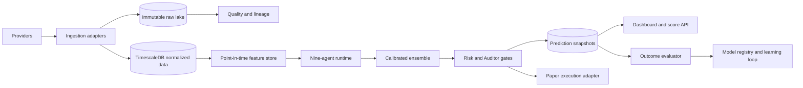

# System Architecture

## Goal

For an input such as `AAPL` and `2026-08-23T14:30:00Z`, return a reproducible
score snapshot with ticker, as-of timestamp, score from 0 to 10, confidence,
action state, component scores, evidence, risks, data quality, and model IDs.

The product is an analysis and validation platform first. Trading is a later,
separately gated capability.

## Logical Components

- Provider adapters isolate APIs, credentials, licensing, and rate limits.
- Ingestion validates payloads, normalizes time zones and symbols, stores the
  original payload hash, and never overwrites raw records.
- Feature generation uses only records whose effective time is at or before
  `as_of`.
- Agents use typed inputs and outputs; unavailable data is explicit.
- The ensemble records calibrated, versioned model weights.
- Risk Management and Performance Auditor vetoes are fail-closed and visible.

## Sprint 2 Vendor and Source Policy

Score each vendor from 0 to 5 for coverage, reliability, rate-limit capacity,
cost, and latency. The weighted vendor score is `0.30 coverage + 0.30
reliability + 0.10 rate limits + 0.15 cost + 0.15 latency`. Reliability and
coverage are evidence-based; cost and latency are measured by our account and
deployment region. A vendor cannot be primary for a critical domain unless it
has a tested fallback and a recorded license/usage constraint.

| Domain | Primary candidate | Fallback candidate | Ingestion cadence |
| --- | --- | --- | --- |
| Price/OHLCV | Polygon or licensed exchange feed | Yahoo Finance adapter | streaming/1m; daily reconciliation |
| Fundamentals | SEC XBRL/company filings | Alpha Vantage or Financial Modeling Prep | filing event; daily refresh |
| News | Reuters/Bloomberg licensed feed | Yahoo Finance/SEC releases | event-driven; 5m backfill |
| Sentiment | Licensed social provider | Reddit/news aggregates | 5-15m; daily aggregate |
| Macro | FRED and official releases | OECD/World Bank datasets | release event; hourly poll |
| FX | ECB/FRED reference rates | Polygon or broker feed | 1m during market hours; daily close |
| Corporate actions | Exchange/issuer/SEC feed | Polygon or EODHD | event-driven; daily reconciliation |

Candidates are not commitments: licensing, jurisdiction, service terms, and
actual account access must be verified before implementation. Data providers
must be accessed through adapters, not directly by agents.

## MCP Decision

Use MCP in parallel-purpose mode, behind the provider and tool boundary. An MCP
server may expose read-only, audited research tools (source search, filings,
retrieval, and feature inspection) to LLM agents. It does not replace the
deterministic ingestion pipeline, database, feature store, or paper execution
adapter. MCP tools receive an `as_of` timestamp and return source IDs and
publication times. No MCP tool may place an order or bypass vetoes.

## Latency Budget

Target end-to-end interactive scoring latency is 10 seconds at p95 for cached
data and 60 seconds at p95 for a refresh. Budget: request validation 0.2s,
feature retrieval 1.5s, parallel agents 5s, ensemble and gates 1s, persistence
1s, and API response 0.3s. Streaming market updates have a 2-second p95
freshness target; filings/news are event-driven with a 5-minute detection
target. A missed budget lowers confidence and is recorded, never hidden.

## Point-in-Time Contract

Every record must include `event_time`, `published_time`, `observed_time`,
`ingested_time`, `source_id`, and `source_record_id`. For a prediction at
`as_of`, only records with `published_time <= as_of` are eligible. If published
time is unknown, the record is excluded from predictive features and marked
`unusable_for_point_in_time`.

Prices use UTC internally and retain exchange-local session metadata. Corporate
actions, ticker changes, delistings, and restatements are versioned rather than
mutated in place.

## Modes and Failure Policy

- `ANALYSIS_ONLY`: scoring and explanation; no orders.
- `PAPER`: simulated orders and fills only.
- `LIVE_DISABLED`: default until all gates pass.
- `LIVE_APPROVED`: explicit approval and audit trail; out of scope initially.

Stale, conflicting, incomplete, or low-quality critical data causes degraded
confidence or `NO_TRADE`. The system must never fill missing financial data
with a guessed value. All failures attach to the score snapshot.