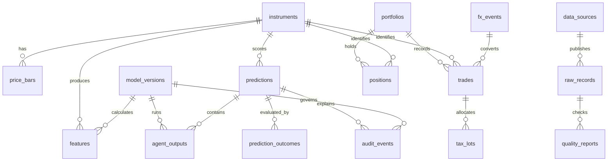

# Data Model

Use PostgreSQL with TimescaleDB for metadata, lineage, predictions,
time-series features, evaluations, and controls.
Use object storage or a local Parquet lake for immutable raw and normalized
market/news documents. The database stores pointers, hashes, and queryable
features; it is not the only source of truth for raw evidence.

## Core Tables

| Table | Purpose | Identity |
| --- | --- | --- |
| `instruments` | ticker, exchange, asset type, validity interval | `instrument_id` |
| `data_sources` | provider, license, endpoint, source type | `source_id` |
| `raw_records` | immutable payload, hash, timestamps, request metadata | `raw_record_id` |
| `quality_reports` | freshness, completeness, validity, anomaly checks | `quality_id` |
| `source_reliability` | time-windowed source score and sample count | `source_id, metric, window_end` |
| `price_bars` | OHLCV and adjustment metadata | `instrument_id, interval, bar_time` |
| `fundamentals` | reported metrics and filing period | `instrument_id, metric, period_end, published_time` |
| `news_events` | article, filing, release, guidance, analyst action | `event_id` |
| `macro_observations` | release value, revision, consensus, publication time | `series_id, period, published_time` |
| `features` | named feature vector and calculation version | `instrument_id, as_of, feature_set_version` |
| `agent_runs` | input hashes, output, status, latency, model version | `run_id` |
| `predictions` | final and component scores with explanation | `prediction_id` |
| `prediction_outcomes` | horizon, realized return, drawdown, label | `prediction_id, horizon` |
| `model_registry` | artifact, code/data versions, approval state | `model_version` |
| `portfolio_snapshots` | holdings, exposure, limits at a timestamp | `portfolio_id, as_of` |
| `paper_orders` | simulated intent, fill, slippage, rejection reason | `order_id` |
| `audit_events` | immutable decisions, vetoes, approvals, changes | `audit_id` |

## TimescaleDB Rules

`price_bars`, `features`, `agent_outputs`, and `predictions` are hypertables
partitioned by their UTC timestamp. Each has a composite uniqueness constraint
that includes instrument, timestamp, version, and interval where applicable.
Time-series rows are append-only. Corrections create a new `data_version` and
retain the superseded row. Continuous aggregates may power dashboards but are
never used as the authoritative research store.

## ER Diagram

The migration in `db/migrations/001_initial_schema.sql` is schema only. It
includes compliance and tax fields from day one: immutable audit events,
account/portfolio ownership, order and fill timestamps, currency and FX event
references, tax lots, holding periods, cost basis, wash-sale flags, and source
lineage. Tax treatment remains jurisdiction-specific and requires professional
review before real use.

## Prediction Record

Store ticker/instrument, `as_of`, score, bullish/bearish components, confidence,
uncertainty band, every agent output, missing agents, weights, model versions,
input hashes, cited evidence, contradictory evidence, data quality, source
reliability, regime, risk limits, vetoes, final `action_state`, schema version,
and deterministic request ID.

## Reliability and Reproducibility

Score each provider and data type using freshness, coverage, schema validity,
cross-source agreement, revision frequency, and out-of-sample forecast
contribution. Keep the score and its window visible; never silently discard a
weak source. Raw records and prediction inputs are append-only. Every derived
row records source hashes and transformation version so predictions and
backtests can be replayed, including superseded versions.